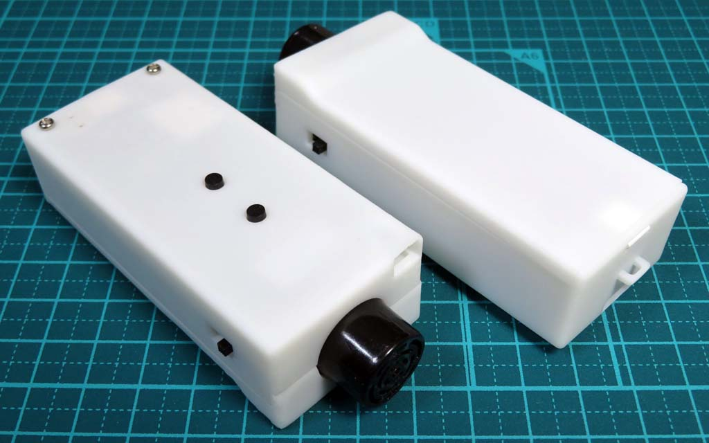
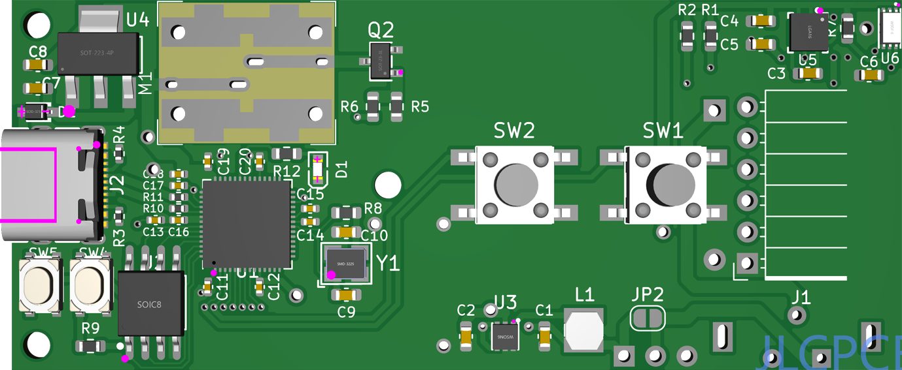
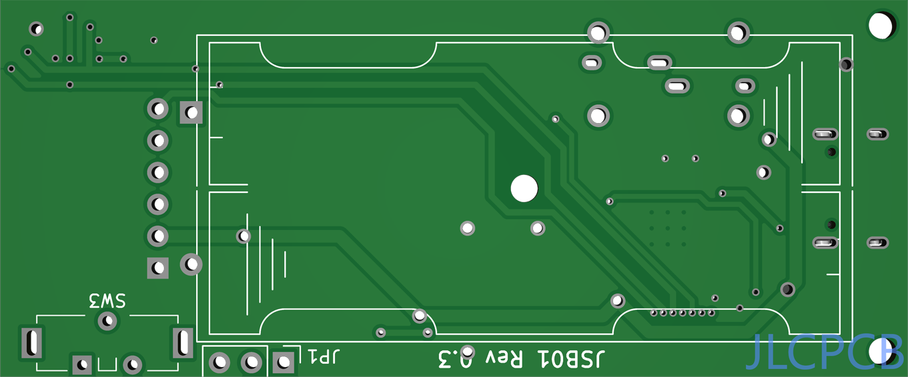
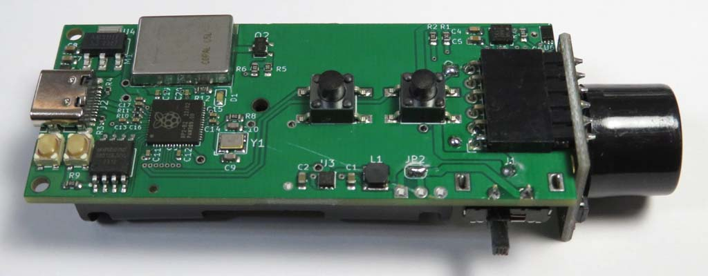
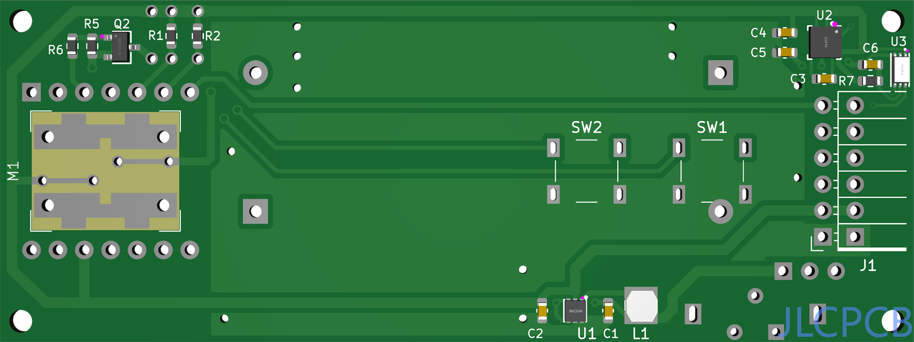
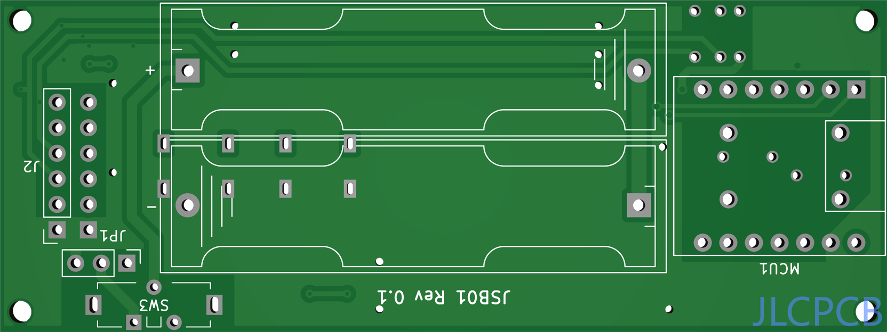
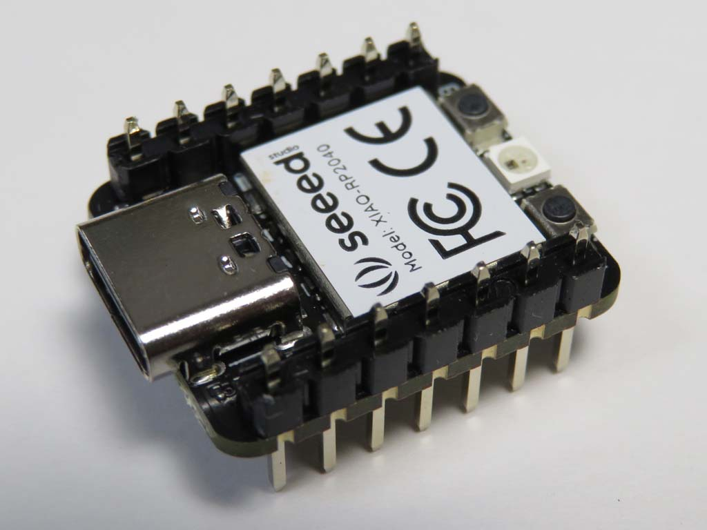
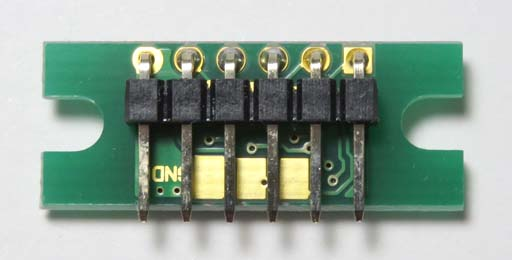
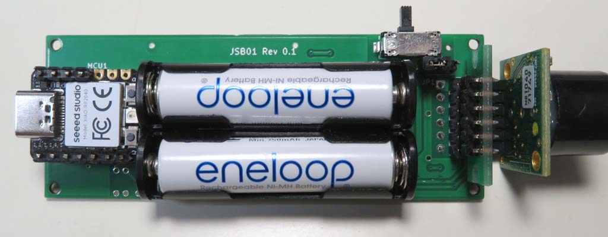

# JSB01ハードウェア

視覚障害者の歩行支援デバイスです。距離センサー、地磁気センサー(コンパス)、照度センサーを備え、振動によって情報を伝えます。

# コンテンツ
- **KiCad** 
[KiCad](https://www.kicad.org/)のプロジェクトです。Rev.1の**JSB01.kicad_pro**と、Rev.3の**JSB01R3.kicad_pro**の２つのプロジェクトファイルがあります。シンボルとフットプリントは共通です。
- **Blender** 
3Dプリントケース作成用のBlenderのプロジェクトファイルと、発注に使用したSTLファイルです。

# 基板の組み立て(Rev.3)
  

表面実装部品(SMD)は[JLCPCB](https://jlcpcb.com/)などPCB基板発注業者で実装できます。それ以外にはんだ付けする必要な部品のリストを載せます。

- [リニア振動アクチュエータ LD14](https://akizukidenshi.com/catalog/g/gP-06838/) 
こちらもSMDなので、基板業者へ部品を送って実装してもらうのがベストですが、手はんだの場合は、まずリード線をLD14の裏へはんだ付けした上で、リード線を基板の穴から引き出してはんだ付けして固定します。
- [L型ピンソケット(6P)](https://akizukidenshi.com/catalog/g/gC-09862/) 
MaxBotixの超音波センサー[MB10XXシリーズ](https://akizukidenshi.com/catalog/g/gM-08238/)を付けるソケットです。超音波センサーの基板側にも、GND～PW端子の6ピンに、ピンヘッダを付ける必要があります。
- [スライドスイッチ(ESD175202)](https://akizukidenshi.com/catalog/g/gP-08944/)
- [単4×2 電池ケース(SN4-2PC)](https://www.marutsu.co.jp/pc/i/65116/)

他に、電流測定用のJP1に3ピンヘッダを付けてジャンパピンを付けるか、JP2のソルダジャンパーをはんだで繋げます。 

# 基板の組み立て(Rev.1)
  

最初に作った基板です。リビジョンが跳んでいるのは、Rev.2から3Dプリントケースを作ったためで、設計した基板はこの２種類だけです。これは[キャンドゥのケース](https://ec.cando-web.co.jp/item/4582547004810/)に収めるサイズで作りました。[Seeed Studio XIAO](https://wiki.seeedstudio.com/SeeedStudio_XIAO_Series_Introduction/)シリーズが載るソケットと、超音波センサーの他に[ストロベリーリナックス](https://strawberry-linux.com)の[TOFセンサー](https://strawberry-linux.com/catalog/items?code=15311)を付けられます。Rev.3以外に必要な部品のリストを載せます。
- [XIAO RP2040](https://wiki.seeedstudio.com/XIAO-RP2040/) 
 
高さを低く収めるために、上からピンヘッダを差し込んではんだ付けします。
- [TOFセンサー](https://strawberry-linux.com/catalog/items?code=15311) 
 
このように、上下逆向きにして裏に[L型ピンヘッダ](https://akizukidenshi.com/catalog/g/gC-12985/)を付けます。
- [シングルピンソケット(低メス)](https://akizukidenshi.com/catalog/g/gC-03138/) 
XIAO RP2040とTOFセンサーを載せるために使います。
- [タクトスイッチ×2](https://akizukidenshi.com/catalog/g/gP-03647/)
- [単4電池ボックス×2](https://akizukidenshi.com/catalog/g/gP-02670/)
 

# 3Dプリントケース
R2(r2)がRev.1基板用、R3(r3)がRev.3基板用のケースです。Rev.1用ケースでは、照度センサー用の穴をチップの上面に開けていましたが、Rev.3では凹面鏡の様に加工して前方からの光を取り入れるようにしました。そのため、凹面鏡の部分を[メタリックの塗料](https://www.mr-hobby.com/ja/product1/category_10/3670.html)で塗る必要があります。
