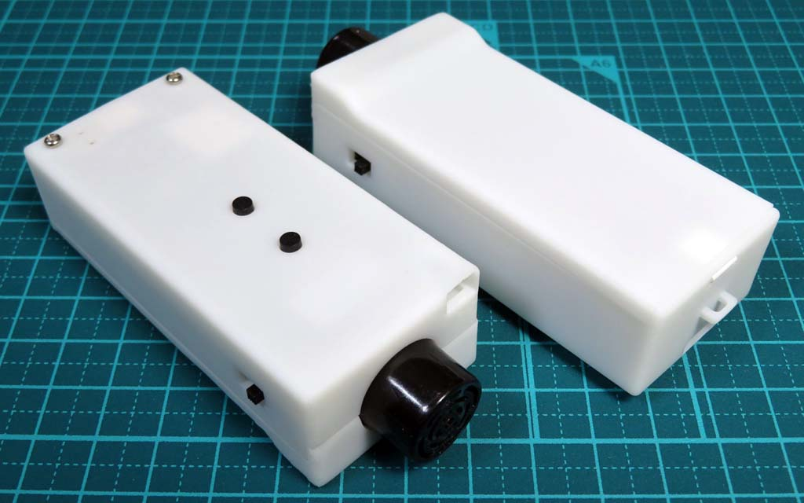
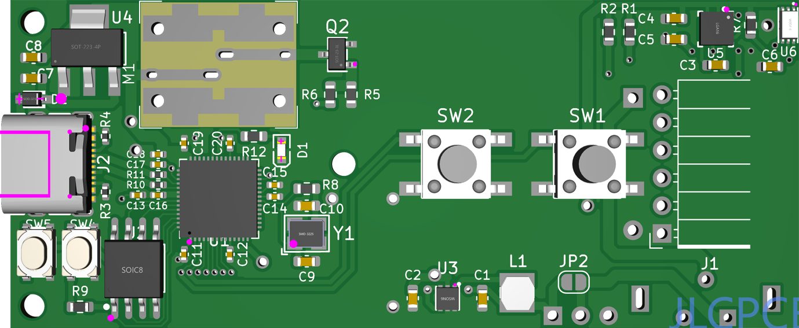
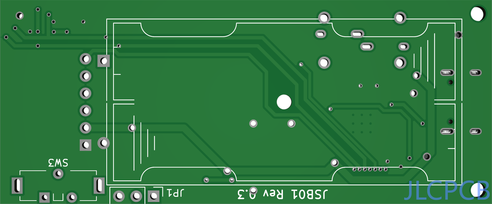
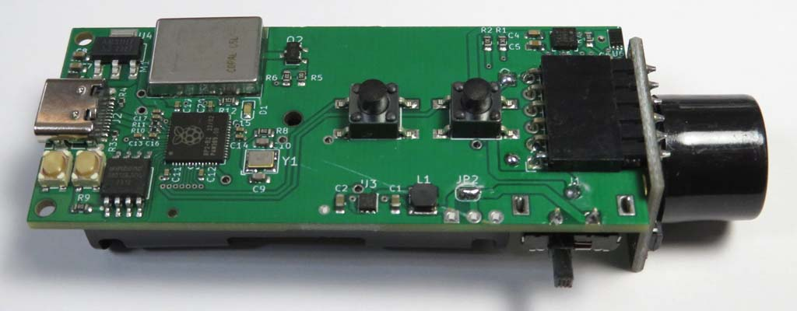
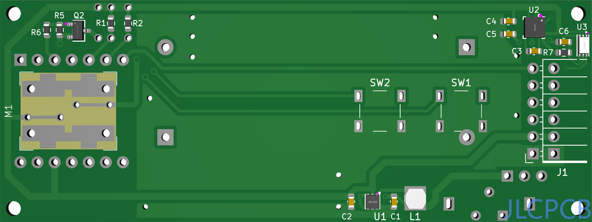
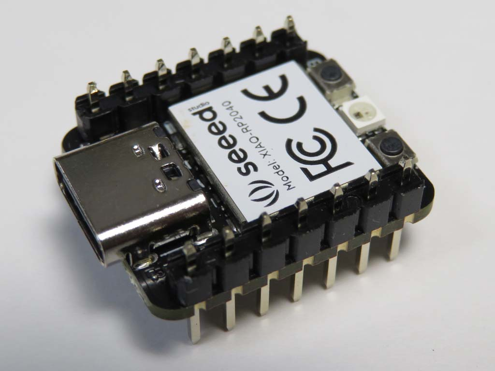
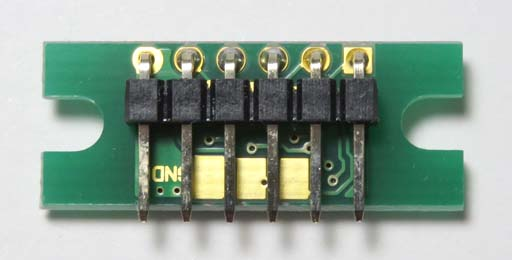
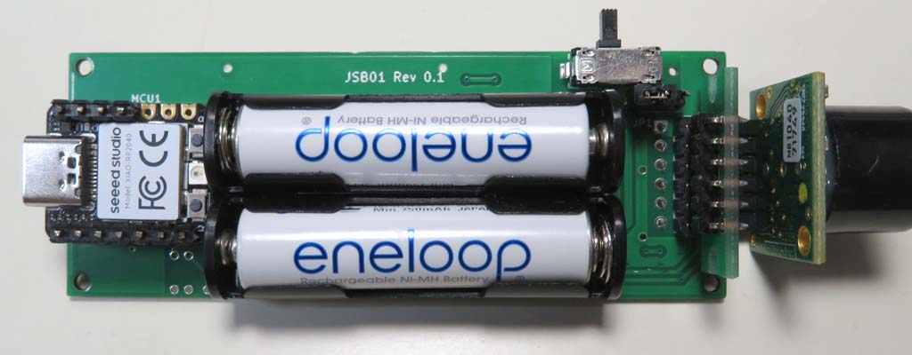

# JSB01

視覚障害者の歩行支援デバイスです。距離センサー、地磁気センサー(コンパス)、照度センサーを備え、振動によって情報を伝えます。

# コンテンツ
- **Firmware** 
PlatformIOでビルドできるソースコードです(動作テスト用)。[XIAO RP2040](https://wiki.seeedstudio.com/XIAO-RP2040/)(Rev.1)と、基板実装のRP2040(Rev.3)に対応しています。
- **KiCad** 
[KiCad](https://www.kicad.org/)のプロジェクトです。Rev.1の**JSB01.kicad_pro**と、Rev.3の**JSB01R3.kicad_pro**の２つのプロジェクトファイルがあります。シンボルとフットプリントは共通です。
- **Blender** 
3Dプリントケース作成用のBlenderのプロジェクトファイルと、発注に使用したSTLファイルです。

# 使い方
動作テスト用コードの使い方です。
### 距離センサーモード
電源を入れると距離センサーモードになります。Rev.1でTOFセンサーが装着されている場合は、TOFセンサーが優先されます。障害物までの距離が遠いと振動する間隔が長くなり、近いと短くなります。ボタンで振動する再長距離を1M単位で切り替えます。SW1(前方)で長く、SW2(後方)で短くなります。最大5M、最小1M、初期値は3Mです。

### 地磁気センサーモード
SW1を押しながら電源を入れると、地磁気センサーモードになります。北に近づくほど短い周期で振動します。一周しても短く振動しない場合は、キャリブレーションが必要です。SW1を押したまま、水平に360度一周してから離してください。キャリブレーションしたデータは、電源を切っても保持されます。

### 照度センサーモード
SW2を押しながら電源を入れると、照度(明るさ)センサーモードになります。明るいほど短い周期で振動します。

# 超音波センサーとTOFセンサー
### 超音波センサー
MaxBotixの超音波センサー[MB10XXシリーズ](https://maxbotix.com/collections/lv-maxsonar-ez-products)を使います。単眼の超音波距離センサーは他にもありますが、3.3Vで動作するためにこれを選択しました。このシリーズには、[MB10X0](https://akizukidenshi.com/catalog/g/gM-08238/)と、[MB10X3](https://akizukidenshi.com/catalog/g/gM-08239/)の２種類があります。
||MB10X0|MB10X3|
| ---- | ---- | ---- |
|計測単位|インチ|ミリ|
|計測周期|20Hz(50mS)|10Hz(100mS)|

このプログラムでは、初期化時に応答の時間を測って、どちらのセンサーかを認識しています。
**MB101X**～**MB104X**の違いは、ビームパターン図を見る限り、数字が上がるほど**近くの小さな**物体の検出範囲が狭まります。

### TOFセンサー
超音波センサーと比べて、コンパクトで安価で検出角度を設定する機能もあり、当初はこちらを使う予定でしたが、直射日光下では全く機能しないことが判って使用を断念しました。コードは、[VL53L1X](https://strawberry-linux.com/catalog/items?code=15311)と、[VL53L5X](https://strawberry-linux.com/catalog/items?code=15315)に対応しています。SW1の長押しで広範囲、SW2の長押しで狭範囲に切り替えます(初期値は広範囲)。

# 基板の組み立て(Rev.3)
  

表面実装部品(SMD)は[JLCPCB](https://jlcpcb.com/)などPCB基板発注業者で実装できます。それ以外にはんだ付けする必要な部品のリストを載せます。

- [リニア振動アクチュエータ LD14](https://akizukidenshi.com/catalog/g/gP-06838/) 
こちらもSMDなので、基板業者へ部品を送って実装してもらうのがベストですが、手はんだの場合は、まずリード線をLD14の裏へはんだ付けした上で、リード線を基板の穴から引き出してはんだ付けして固定します。
- [L型ピンソケット(6P)](https://akizukidenshi.com/catalog/g/gC-09862/) 
MaxBotixの超音波センサー[MB10XXシリーズ](https://akizukidenshi.com/catalog/g/gM-08238/)を付けるソケットです。超音波センサーの基板側にも、GND～PW端子の6ピンに、ピンヘッダを付ける必要があります。
- [スライドスイッチ(ESD175202)](https://akizukidenshi.com/catalog/g/gP-08944/)
- [単4×2 電池ケース(SN4-2PC)](https://www.marutsu.co.jp/pc/i/65116/)

他に、電流測定用のJP1に3ピンヘッダを付けてジャンパピンを付けるか、JP2のソルダジャンパーをはんだで繋げます。 

# 基板の組み立て(Rev.1)
  

最初に作った基板です。リビジョンが跳んでいるのは、Rev.2から3Dプリントケースを作ったためで、設計した基板はこの２種類だけです。これは[キャンドゥのケース](https://ec.cando-web.co.jp/item/4582547004810/)に収めるサイズで作りました。[Seeed Studio XIAO](https://wiki.seeedstudio.com/SeeedStudio_XIAO_Series_Introduction/)シリーズが載るソケットと、超音波センサーの他に[ストロベリーリナックス](https://strawberry-linux.com)の[TOFセンサー](https://strawberry-linux.com/catalog/items?code=15311)を付けられます。Rev.3以外に必要な部品のリストを載せます。
- [XIAO RP2040](https://wiki.seeedstudio.com/XIAO-RP2040/) 
 
高さを低く収めるために、上からピンヘッダを差し込んではんだ付けします。
- [TOFセンサー](https://strawberry-linux.com/catalog/items?code=15311) 
 
このように、上下逆向きにして裏に[L型ピンヘッダ](https://akizukidenshi.com/catalog/g/gC-12985/)を付けます。
- [シングルピンソケット(低メス)](https://akizukidenshi.com/catalog/g/gC-03138/) 
XIAO RP2040とTOFセンサーを載せるために使います。
- [タクトスイッチ×2](https://akizukidenshi.com/catalog/g/gP-03647/)
- [単4電池ボックス×2](https://akizukidenshi.com/catalog/g/gP-02670/)
 

# 3Dプリントケース
R2(r2)がRev.1基板用、R3(r3)がRev.3基板用のケースです。Rev.1用ケースでは、照度センサー用の穴をチップの上面に開けていましたが、Rev.3では凹面鏡の様に加工して前方からの光を取り入れるようにしました。そのため、凹面鏡の部分を[メタリックの塗料](https://www.mr-hobby.com/ja/product1/category_10/3670.html)で塗る必要があります。
